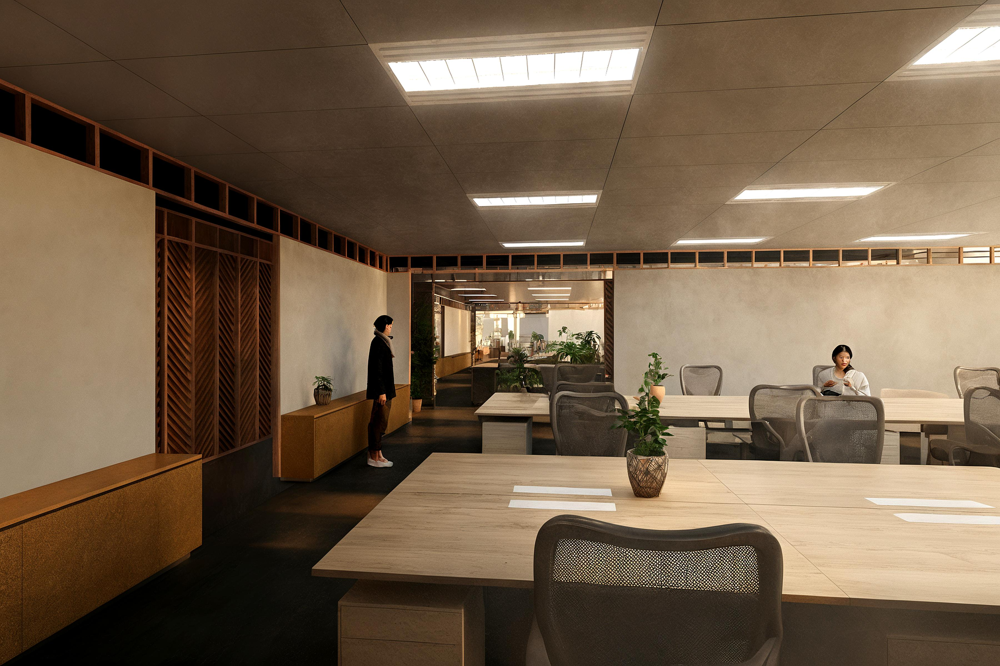
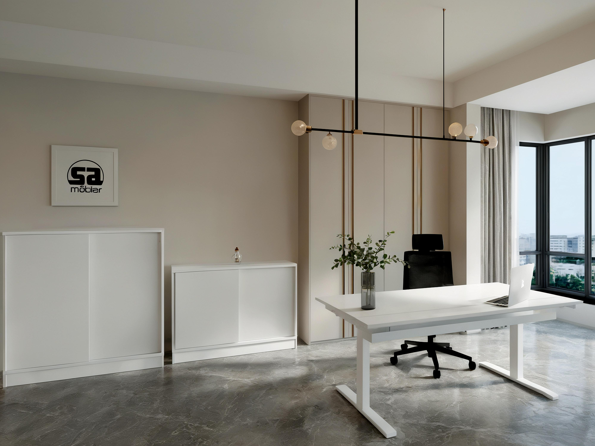
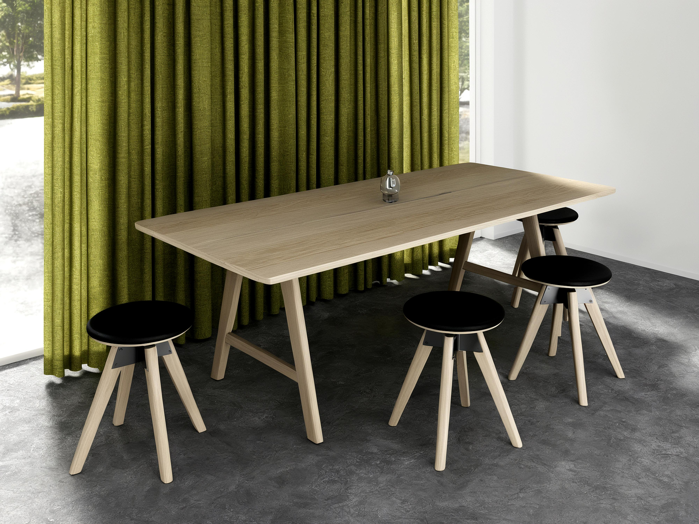

# Render2Photo Converter Tool

This project transforms 3D renders of office interiors into photorealistic images using LoRA-Adapter.

Frontend view:


Demo:
<a href="https://youtu.be/-vOdhZCySgE?si=Af6AObHhfH4fZkqn?autoplay=1"></a>

Example transformations:
<table>
  <tr>
    <td width="45%" align="center"><b>Input Photo</b></td>
    <td width="45%" align="center"><b>Output Photo</b></td>
  </tr>
  <tr>
    <td></td>
    <td></td>
  </tr>
  <tr>
    <td></td>
    <td></td>
  </tr>
  <tr>
    <td></td>
    <td></td>
  </tr>
</table>

Images by PerOla Hammar and Gia Tu Tran, posted on Unsplash.

## Getting Started

1. Create and activate a virtual environment:
   ```bash
   # Create and activate virtual environment
   python -m venv venv
   
   # For Mac/Linux:
   source venv/bin/activate
   # For Windows:
   venv\Scripts\activate
   
   # Install requirements
   pip install -r requirements.txt
   ```

2. You can work with the script using three methods:

   **Option A: Batch Processing Script**
   - Place images in the `task-images` folder (images in subfolders will not be processed)
   - Run the script:
     ```bash
     python scripts/enhance-image-lora_sdxl_render2photo_enhanced.py
     ```
   - Results will be saved to the `processed-images` folder
   - A `settings.json` file will be generated for reproducibility
   - You can specify custom input and output directories using settings in the script

   **Option B: API**
   - Start the API server:
     ```bash
     python api.py
     ```
   - Open Postman and import the collection: `enhance_image.postman_collection.json` ([link](enhance_image.postman_collection.json))
   - Run the 'Process image' request (adjust the URL if necessary)

   **Option C: Web-Interface**
   - Start the API server:
     ```bash
     python api.py
     ```
   - Change to the web-interface directory, install the requirements and run the server:
     ```bash
     cd website/render2image-processor/ 
     npm i
     npm run dev -- --host 0.0.0.0
     ```
   - Open the URL in your browser that is displayed after you run the server

3. **Optional**: After you finished working, clear cache to free up disk space:
   ```bash
   rm -rf ~/cache/huggingface/hub/models--stabilityai--sdxl-vae
   rm -rf ~/cache/huggingface/hub/models--stabilityai--stable-diffusion-xl-base-1.0
   ```
   (This removes downloaded Stable Diffusion models that may occupy significant space)

## Training on your own data

To train your own LoRA-Adapter, you need to do the following:
1. Collect the image pairs - 3d-renders and photos and post them on Hugging Face using the following structure:
    - photos
      - 0.png
      - 1.png
      - ...
    - renders
      - 0.png
      - 1.png
      - ...
    - metadata.json
      ```
      {
        {
          id: 0,
          photo_path: "path",
          render_path: "path",
          ...
        },
        ...
      }
      ```

2. Add your Hugging Face token with this dataset to the .env file under HUGGING_FACE_TOKEN variable
3. Run the script scripts/final-fine-tune-lora-with-descaled-aspect-ratio.py
4. This will produce a LoRA-adapter, that you can use for the inference script


## Parameters

The following parameters can be customized:

<table width="100%">
  <tr width="100%">
    <th width="20%">Parameter</th>
    <th width="40%">Default</th>
    <th width="40%">Description</th>
  </tr>
  <tr>
    <td><code>BASE_MODEL_PATH</code></td>
    <td>stabilityai/stable-diffusion-xl-base-1.0</td>
    <td>Base model for image generation</td>
  </tr>
  <tr>
    <td><code>VAE_PATH</code></td>
    <td>stabilityai/sdxl-vae</td>
    <td>Improved VAE for better color reproduction</td>
  </tr>
  <tr>
    <td><code>LORA_DIR</code></td>
    <td>lora_sdxl_render2photo_enhanced/lora-weights-epoch-15</td>
    <td>Directory containing trained LoRA weights</td>
  </tr>
  <tr>
    <td><code>INPUT_DIR</code></td>
    <td>task-images</td>
    <td>Directory for input images</td>
  </tr>
  <tr>
    <td><code>OUTPUT_DIR</code></td>
    <td>processed-images</td>
    <td>Directory for processed images</td>
  </tr>
  <tr>
    <td><code>PROMPT</code></td>
    <td>high quality photograph, photorealistic, masterpiece, high quality, detailed, realistic, photorealistic, consistent shapes, consistent lighting, consistent shadows, preserve as many details from the original image as possible, 8k, 4k, sharp focus</td>
    <td>General prompt for image enhancement</td>
  </tr>
  <tr>
    <td><code>FACE_PROMPT</code></td>
    <td>high quality photograph, photorealistic, masterpiece, perfect face details, realistic face features, high quality, detailed face, ultra realistic human face, perfect eyes, perfect skin texture, perfect facial proportions, clean render</td>
    <td>Specialized prompt for face enhancement</td>
  </tr>
  <tr>
    <td><code>NEGATIVE_PROMPT</code></td>
    <td>low quality, bad anatomy, bad hands, text, error, blurry, out of focus, low resolution, cropped, worst quality, jpeg artifacts, signature, watermark, distorted</td>
    <td>Characteristics to avoid in generation</td>
  </tr>
  <tr>
    <td><code>FACE_NEGATIVE_PROMPT</code></td>
    <td>low quality, bad anatomy, distorted face, deformed face, disfigured face, unrealistic face, bad eyes, crossed eyes, misaligned eyes, bad nose, bad mouth, bad teeth, bad skin</td>
    <td>Face-specific characteristics to avoid</td>
  </tr>
  <tr>
    <td><code>STRENGTH</code></td>
    <td>0.4</td>
    <td>General processing strength</td>
  </tr>
  <tr>
    <td><code>FACE_STRENGTH</code></td>
    <td>0.35</td>
    <td>Face processing strength</td>
  </tr>
  <tr>
    <td><code>GUIDANCE_SCALE</code></td>
    <td>6.0</td>
    <td>Strength of prompt adherence</td>
  </tr>
  <tr>
    <td><code>FACE_GUIDANCE_SCALE</code></td>
    <td>8.0</td>
    <td>Face-specific prompt adherence</td>
  </tr>
  <tr>
    <td><code>RESIZE_LIMIT</code></td>
    <td>2048</td>
    <td>Maximum dimension for image resizing</td>
  </tr>
  <tr>
    <td><code>SEED</code></td>
    <td>42</td>
    <td>Random seed for reproducible results</td>
  </tr>
  <tr>
    <td><code>UNET_RANK</code></td>
    <td>32</td>
    <td>UNet rank from training script</td>
  </tr>
  <tr>
    <td><code>TEXT_ENCODER_RANK</code></td>
    <td>8</td>
    <td>Text encoder rank from training script</td>
  </tr>
  <tr>
    <td><code>LORA_SCALE</code></td>
    <td>0.8</td>
    <td>LoRA influence for main image processing</td>
  </tr>
  <tr>
    <td><code>FACE_LORA_SCALE</code></td>
    <td>0.3</td>
    <td>LoRA influence for face regions</td>
  </tr>
  <tr>
    <td><code>NUM_STEPS</code></td>
    <td>400</td>
    <td>Number of diffusion steps for main image</td>
  </tr>
  <tr>
    <td><code>FACE_NUM_STEPS</code></td>
    <td>200</td>
    <td>Number of steps for face regions</td>
  </tr>
  <tr>
    <td><code>USE_CUSTOM_NOISE</code></td>
    <td>True</td>
    <td>Enable custom noise initialization</td>
  </tr>
  <tr>
    <td><code>MIXED_PRECISION</code></td>
    <td>fp16</td>
    <td>Precision setting for inference</td>
  </tr>
  <tr>
    <td><code>GRADIENT_CHECKPOINTING</code></td>
    <td>True</td>
    <td>Memory optimization technique</td>
  </tr>
  <tr>
    <td><code>POST_PROCESS</code></td>
    <td>False</td>
    <td>Enable post-processing</td>
  </tr>
  <tr>
    <td><code>CONTRAST_FACTOR</code></td>
    <td>1.2</td>
    <td>Contrast enhancement factor</td>
  </tr>
  <tr>
    <td><code>SHARPNESS_FACTOR</code></td>
    <td>1.7</td>
    <td>Sharpness enhancement factor</td>
  </tr>
  <tr>
    <td><code>SATURATION_FACTOR</code></td>
    <td>1.1</td>
    <td>Saturation enhancement factor</td>
  </tr>
  <tr>
    <td><code>FACE_DETECTION_CONFIDENCE</code></td>
    <td>0.7</td>
    <td>Confidence threshold for detection</td>
  </tr>
  <tr>
    <td><code>FACE_PADDING_PERCENT</code></td>
    <td>30</td>
    <td>Percentage to expand face crop area</td>
  </tr>
  <tr>
    <td><code>ENABLE_FACE_ENHANCEMENT</code></td>
    <td>False</td>
    <td>Enable specialized face processing</td>
  </tr>
  <tr>
    <td><code>DEBUG_MODE</code></td>
    <td>True</td>
    <td>Visualize face detection</td>
  </tr>
  <tr>
    <td><code>USE_DNN_FACE_DETECTOR</code></td>
    <td>True</td>
    <td>Use robust DNN face detector</td>
  </tr>
  <tr>
    <td><code>FACE_DETECTOR_MODEL_PATH</code></td>
    <td>models/opencv_face_detector_uint8.pb</td>
    <td>Path to detector model</td>
  </tr>
  <tr>
    <td><code>FACE_DETECTOR_CONFIG_PATH</code></td>
    <td>models/opencv_face_detector.pbtxt</td>
    <td>Path to detector config</td>
  </tr>
  <tr>
    <td><code>MAX_IMG_SIZE</code></td>
    <td>2048</td>
    <td>Maximum image size for resizing</td>
  </tr>
  <tr>
    <td><code>USE_EMA</code></td>
    <td>True</td>
    <td>Enable Exponential Moving Average</td>
  </tr>
  <tr>
    <td><code>EMA_DECAY</code></td>
    <td>0.9995</td>
    <td>EMA decay rate from training script</td>
  </tr>
</table>
